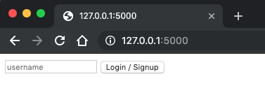
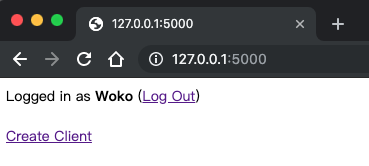
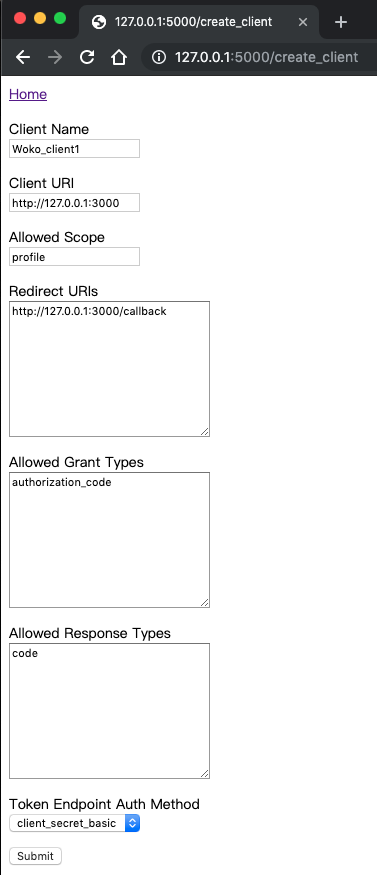
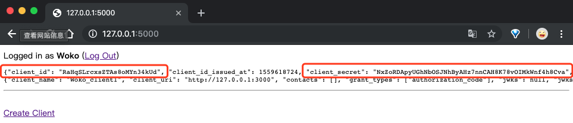
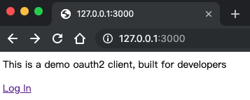
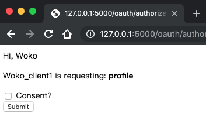
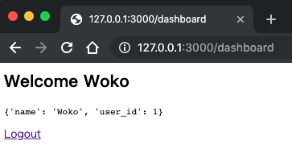
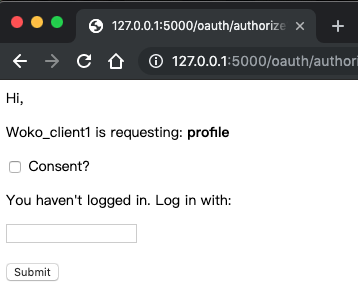

Oauth2.0 examples with Python

> auth0: https://auth0.com/
> 
> authlib: https://github.com/lepture/authlib
> 
> authlib docs: https://docs.authlib.org/en/latest/index.html

codes: 
* server: https://github.com/authlib/example-oauth2-server
* client: https://docs.authlib.org/en/latest/client/flask.html

quick start:

## 1. init database

Create database `test` by yourself on MySQL, then run:

```
$ cd server
$ flask initdb
```
Check the `test` database and you will find four tables have been created.

```
+----------------+
| Tables_in_test |
+----------------+
| oauth2_client  |
| oauth2_code    |
| oauth2_token   |
| user           |
+----------------+
```

## 2. run oauth server

```
$ cd server
$ flask run
```

or you can run
```
python app.py
```

## 3. create user and client

access the server website: http://127.0.0.1:5000



input a name and press the "Login/Signup" button



click the "Create Client" and input like this



after submit you would get the client_id and client_secret



## 4. run client

Open the `client/app.py` and fill the client_id and client_secert

and run client with
```
$ python app.py
```

## 5. try the oauth2.0

access the client website: http://127.0.0.1:3000



click `login`.

because we have logged in the server, it knows our username.



check `Consent` and submit. tada, oauth2 success~



That's all for oauth2 login.
But if you click `Logout`, it would call the server/logout.
And if you want to login with oauth2, you should login the server first.


